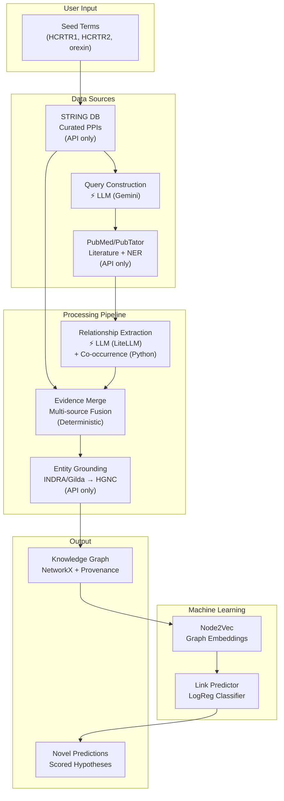
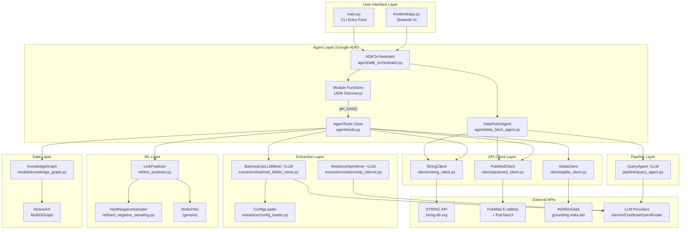
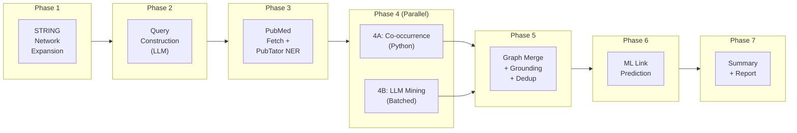
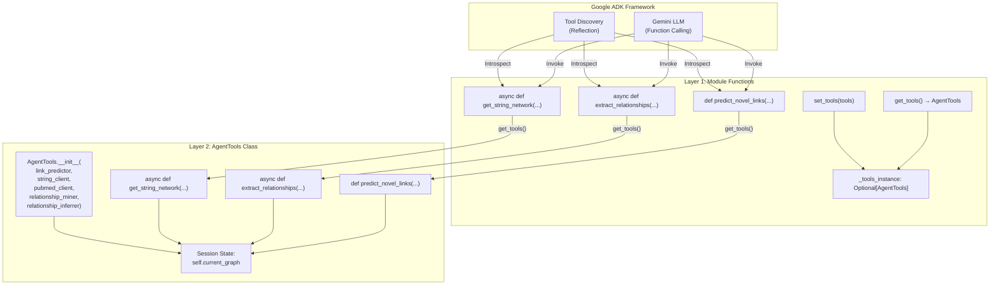
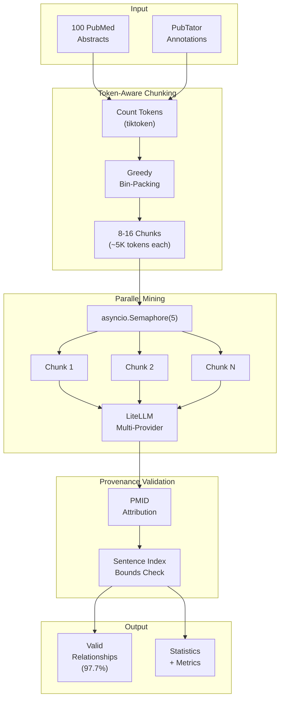
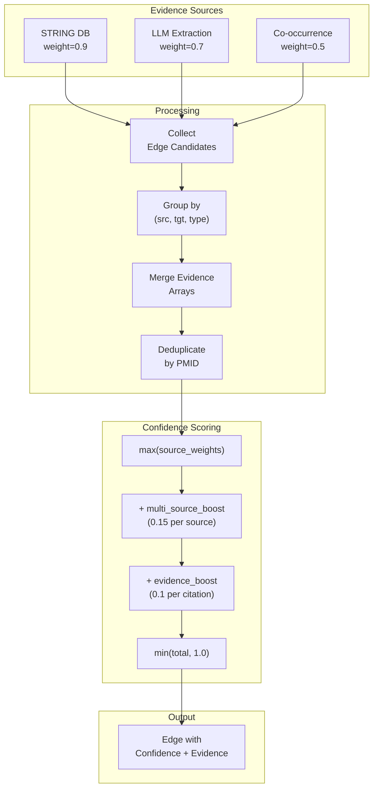
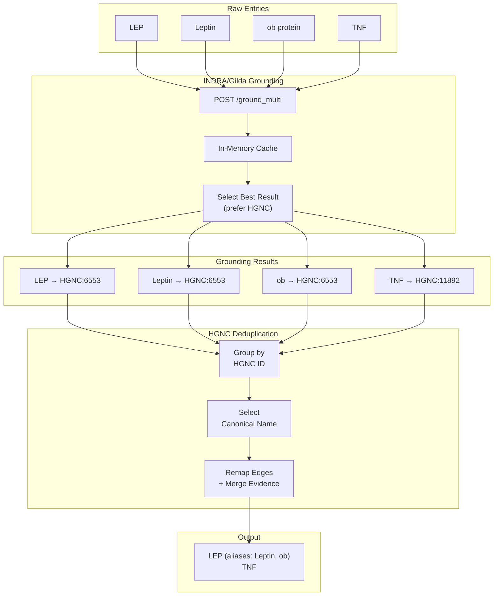
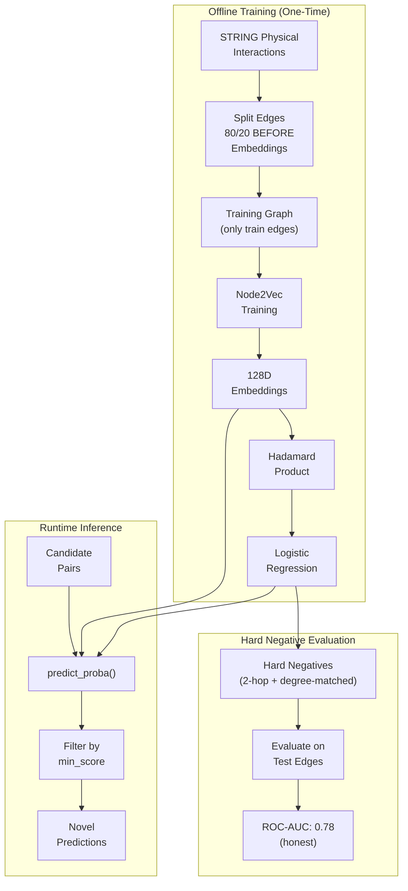

# Tetra V1 Architecture

> **Last Updated**: December 2024
> **Status**: Near-complete research prototype

This document describes the architecture for building and querying scientific knowledge graphs. The system uses Google ADK for agent orchestration, LiteLLM for multi-provider extraction, and Node2Vec+LogReg for link prediction.

---

## Conceptual Architecture (High-Level)



---

## Detailed Architecture (Component-Level)



---

## Seven-Phase Pipeline



**LLM Usage Summary:**
| Phase | Component | Uses LLM? | Details |
|-------|-----------|-----------|---------|
| 1 | STRING Expansion | ❌ No | REST API to string-db.org |
| 2 | Query Construction | ⚡ **Yes** | Gemini via `google.generativeai` |
| 3 | PubMed Fetch | ❌ No | NCBI E-utilities + PubTator3 APIs |
| 4A | Co-occurrence | ❌ No | Pure Python (entity pairs in same PMID) |
| 4B | Relationship Mining | ⚡ **Yes** | LiteLLM (Cerebras/Gemini/GPT-4) |
| 5 | Graph Merge | ❌ No | Deterministic fusion + INDRA/Gilda API |
| 6 | Link Prediction | ❌ No | ML model (Node2Vec + LogReg) |
| 7 | Summary | ❌ No | Aggregation only |

---

## ADK Two-Layer Tool Pattern



---

## Batched Extraction Pipeline



---

## Evidence Integration Flow



---

## Entity Grounding & Deduplication



---

## ML Link Prediction Pipeline



---

## Key Design Decisions

### 1. Node2Vec + LogReg over GNN

| Factor | Node2Vec + LogReg | GCN/GraphSAGE |
|--------|-------------------|---------------|
| Training complexity | CPU-friendly, 30-60 min | Requires GPU, hours |
| Node features | None needed | Requires features |
| Interpretability | Embeddings inspectable | Black box |
| STRING sparsity | Random walks handle well | Message passing struggles |

### 2. Sentence-Index Provenance

| Approach | Validation Rate | Failure Mode |
|----------|-----------------|--------------|
| Text extraction | 62% | Paraphrasing (38%) |
| Sentence indices | 97.7% | Index hallucination (2.3%) |

### 3. Hard Negative Evaluation

| Strategy | ROC-AUC | Interpretation |
|----------|---------|----------------|
| Random negatives | 0.99 | Inflated (degree bias) |
| Combined hard | 0.78 | Honest evaluation |

### 4. Multi-Source Confidence

```
Confidence = max(source_weights)
           + 0.15 × (num_sources - 1)
           + min(0.1 × (evidence_count - 1), 0.2)
```

---

## File Structure

```
tetra_v1/
├── main.py                         # CLI entry point
├── DESIGN.md                       # Design decisions & rationale
├── ARCHITECTURE.md                 # This document
├── DEMO.md                         # Interview preparation guide
│
├── agent/
│   ├── adk_orchestrator.py         # ADK agent + module functions
│   ├── data_fetch_agent.py         # Data fetching orchestrator (STRING + PubMed)
│   ├── tools.py                    # AgentTools class (stateful)
│   └── graph_agent.py              # GraphRAG Q&A agent
│
├── clients/
│   ├── string_client.py            # STRING API (async httpx)
│   ├── pubmed_client.py            # PubMed + PubTator (async)
│   └── gilda_client.py             # INDRA/Gilda grounding (async)
│
├── extraction/
│   ├── batched_litellm_miner.py    # ⚡LLM Batched relationship extraction (LiteLLM)
│   ├── config.toml                 # Prompts + schema definitions
│   ├── config_loader.py            # Provider routing
│   └── relationship_inferrer.py    # ⚡LLM relationship inference
│
├── models/
│   └── knowledge_graph.py          # NetworkX graph + algorithms
│
├── ml/
│   ├── link_predictor.py           # Node2Vec + LogReg
│   └── hard_negative_sampling.py   # Evaluation strategies
│
├── pipeline/
│   ├── config.py                   # PipelineConfig
│   ├── metrics.py                  # TokenUsage, statistics
│   ├── merge.py                    # Evidence aggregation
│   └── query_agent.py              # ⚡LLM PubMed query construction (Gemini)
│
├── frontend/
│   └── app.py                      # Streamlit UI
│
├── scripts/
│   ├── train_link_predictor.py     # Training pipeline
│   ├── benchmark_miner_scale.py    # Performance testing
│   └── test_miner_provenance.py    # Provenance validation
│
└── tests/
    ├── test_batched_litellm_miner.py
    ├── test_link_predictor.py
    └── test_knowledge_graph.py
```

---

## Configuration

### Environment Variables

```bash
# Required
GOOGLE_API_KEY=AIza...              # Gemini access

# Optional
NCBI_API_KEY=...                    # Higher PubMed rate limits
OPENROUTER_API_KEY=sk-or-...        # Cerebras/OpenRouter access
LANGFUSE_PUBLIC_KEY=...             # Observability
LANGFUSE_SECRET_KEY=...
```

### Extraction Config (`extraction/config.toml`)

```toml
[BATCHED]
TARGET_TOKENS_PER_CHUNK = 5000
MIN_CHUNKS = 3
MAX_CONCURRENT = 5
MAX_RETRIES = 3
RETRY_DELAY_MS = 1000
MIN_CONFIDENCE = 0.5
MAX_TOKENS = 8192

[EXTRACTORS.cerebras]
MODEL = "openrouter/openai/gpt-oss-120b"
TEMPERATURE = 0.1

[EXTRACTORS.gemini]
MODEL = "gemini/gemini-2.5-flash"
TEMPERATURE = 0.1
```

---

## Performance Metrics

| Metric | Target | Achieved |
|--------|--------|----------|
| Link predictor AUC (hard neg) | > 0.75 | 0.78-0.86 |
| Provenance validation | > 90% | 97.7% |
| Extraction throughput | > 2000 tok/s | 3,000+ tok/s |
| Entity grounding | > 70% | 75-80% |
| Query response time | < 30s | ~15-25s |

---

## Cost Estimation

Based on Gemini 2.5 Flash pricing:

| Operation | Input Tokens | Output Tokens | Est. Cost |
|-----------|--------------|---------------|-----------|
| Query construction | 2,000 | 500 | $0.0003 |
| Relationship mining (50 papers) | 150,000 | 30,000 | $0.020 |
| Inference (5 predictions) | 10,000 | 2,000 | $0.002 |
| **Total per pipeline run** | ~162,000 | ~32,500 | **~$0.022** |

---

## Future Enhancements

1. **GraphSAGE Upgrade**: Better predictions with learned node features
2. **Neo4j Migration**: For production scale (millions of nodes)
3. **Streaming Responses**: Real-time agent output
4. **Fine-tuned Extraction**: Domain-specific model instead of prompting
5. **Multi-species Support**: Extend HGNC to include model organisms
